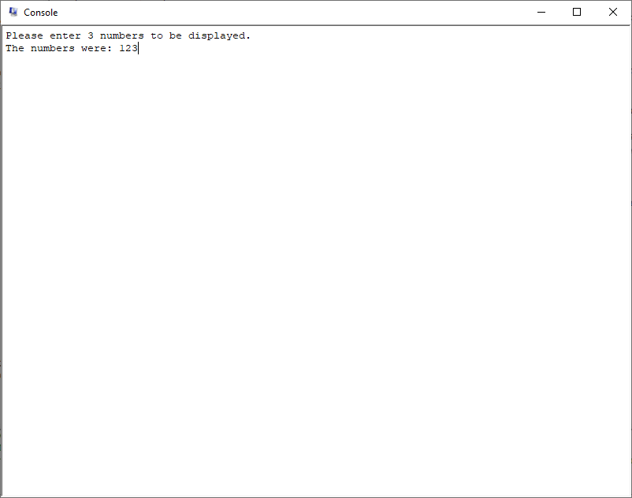
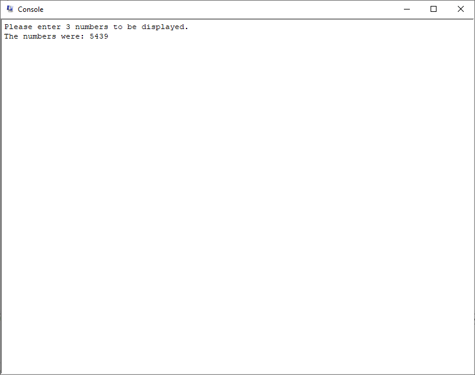
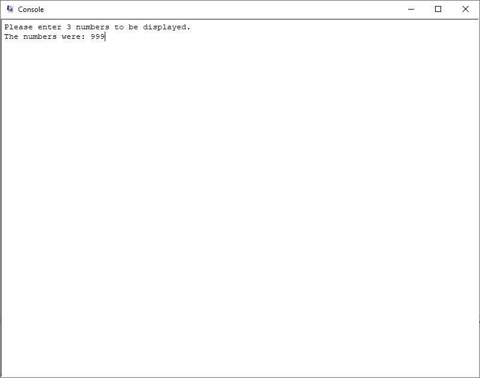

# final1.asm

## Explanation of the code:
#### Description:
Program to take digits through MM I/O and display them
#### MIPS Simulation Settings:
Bare Machine: OFF, Psuedo Instructions: ON, Mapped IO: ON,
Delayed Branches: ON, Delayed Loads: ON
#### Register use:
`$t0` - Receiver Control memory location
`$t1` - holds the Ready bit (Reciever Control register)
`$t2` - holds the actual input from the Receiver Data register
`$t3` - multiplier used in algorithm
`$t4` - temporary register used to construct the int

#### Polling snippet
```
	lui	$t0,  0xFFFF		# Receiver Control memory location
rd_wait:
	# QTSpim throws a "CreateWaitable Timer failed" error that you can't
	# quit out of which gave me a panic attack. don't let it poll too long or that error occurs.
	# also end task wasn't working, CPU started to go pierce the heavens
	# polling section
	lw	$t1, 0($t0)		# load from receiver control register (ready bit)
	andi	$t1, $t1, 1 		# clear all bits except the LSB
	beq	$t1, $zero, rd_wait	# branch if ready bit not 1
	nop
```
This code snippet is called "polling". It is used for when you are waiting for an input. To tell if a character has inputted, we check the ready bit. If the keyboard was pressed, the ready bit would change to 0. Using this, we can poll for if it ever changes, and if it does, we handle it.
#### Handling snippet
```
lw	$t2, 4($t0)		# load data from receiver data register (actual input)
					# $t2 = '1' -> '2' -> '3'
	nop
	addiu	$t2, $t2, -48		# subtract 48 to convert from ASCII characters to int 
					# $t2 = 1 -> 2 -> 3
	mul	$t2, $t2, $t3		# $t2 = 100 -> 20 -> 3
	div	$t3, $t3, 10		# adjusting place value by lowering the multiplier
					# 100 / 10 = 10 -> 10 / 10 = 1 -> 1 / 10 = 0
	addu	$t4, $t4, $t2		# add the output to a temporary register to print later
	bnez	$t3, rd_wait		# if the multplier is 0, then the number has been constructed
	nop
```
This code snippet is for handling the character that we just got from the Receiver Data register. When we get a character from the user, it will be in ASCII text. We want that to be an int, so we subtract 48 from the character inputted to convert it (we can shift the character over in the ASCII table by 48 to make it change from the ASCII text to its actual integer value). We then multiply the number by 100 to allow for constructing the int later on (if you just added 1 + 2 + 3, you would get 6 instead of 100 + 20 + 3 = 123). Divide the multiplier by 10 to adjust the place value, and loop until the number is fully constructed to be printed.
## Test Case Results
#### First Test Case
</br>
In this test case, I inputted `123` into the console to see if it would print properly.
As the picture shows, you can see that it displays the correct numbers.
#### Second Test Case
</br>
In this test case, I inputted `aaa` into the console to see how it would handle characters.
As the picture shows, you can see that it turned the letters into numbers and didn't crash or anything like that.
Was this test case needed? Probably not but I wanted to see what would happen.
#### Third Test Case
</br>
Same thing with this test case, I wanted to see what would happen if I inputted `!!!` into the console.
All it did was change it to numbers just like the `aaa` test.
#### Fourth Test Case
</br>
And finally, in this test case I put in `999` to see if it would print properly, and it did. Woohoo.