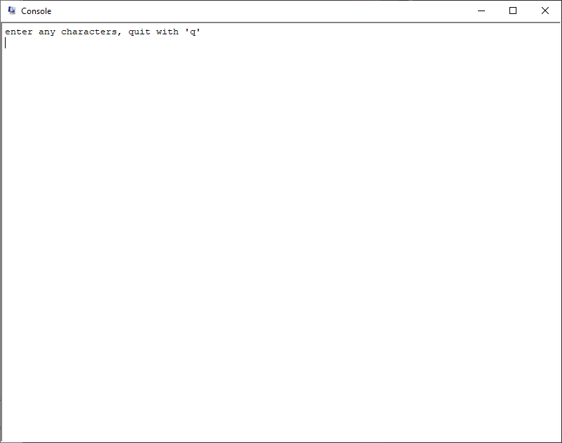

# final2.asm

## Explanation of the code:
#### Description:
Program to take characters from user and display in console  
until 'q' is typed.
#### MIPS Simulation Settings:
Bare Machine: OFF, Psuedo Instructions: ON, Mapped IO: ON,
Delayed Branches: OFF, Delayed Loads: OFF
#### Register use:

- `$t4` - value from status register
- `$t5` - value from cause register

#### loop snippet
```
await:

	j await			# waiting for input weeeeeee
```
This code snippet is simply just a loop to wait until an interrupt occurs.
#### print snippet
```
print:
	li	$v0, 11		# print_char sys call code
	syscall
```
This code snippet is simply just printing out the characters that aren't 'q'.
#### kernal text snippet
```
	.ktext 0x80000180

sw	$v0, thing1		# to be used in ktext
sw	$a0, thing2		# to be used in ktext
mfc0	$k0, $t5		# get cause register
srl	$a0, $k0, 2		# get exception code field (the bit field is 2 to the left)
andi	$a0, $a0, 0x1F		# actually get the exception code
bnez	$a0, done		# we're looking to handle IO (exception code 0)

lui	$v0, 0xFFFF		# Receiver Control memory location
lw	$a0, 4($v0)		# get the character from receiver data register
bne	$a0, 113, print		# if they didn't enter 'q', go to print it

li	$v0, 10			# exit sys call code
syscall
```
This code snippet is where we enter the kernal text area. In here, we're checking the exception code from its field to see if it's either a 0  
(meaning that it is IO), or something other than 0 (which would be an exception). In this case, we only want to handle the IO, so we branch  
if it's not a 0. When the code is 0, we go to the receiver control memory location so that we can get the character that's in the receiver  
data register. We then branch and print that character if it wasn't a 'q'. If it was a 'q', the branch doesn't happen and we proceed to exit.
#### starting snippet
```
li	$v0, 4		# print_string sys call code
	la	$a0, pr1	# address of prompt
	syscall
	mfc0	$a0, $t4	# read from the status register
	li	$a0, 0xFF11	# enables all interrupts
	mtc0	$a0, $t4	# writes back to the status register
	lui	$t0, 0xFFFF	# Receiver Control memory location
	li	$a0, 2		# enable keyboard interrupt
	sw	$a0, 0($t0)	# write back to the receiver data register
```
This code snippet is where we first start the program. We want to enable interrupts and then enable keyboard interrupt so that when the keyboard is hit,  
an interrupt occurs and we can handle that. In this program, we're using the interrupt so that we can print the characters unless the character was a 'q'.
#### ending snippet
```
done:
	lw	$v0, thing1	# restore $v0
	lw	$a0, thing2	# restore $a0
	mtc0	$zero, $t5	# clearing cause register
	mfc0	$k0, $t4	# setting status register
	li	$k0, 0x11	# enable interrupts
	eret			# return to exception program counter
```
This code snippet is showing that we have to make sure to restore `$v0` and `$a0` in the end, while also returning to the excception program counter.
## Test Case Results
#### First Test Case
</br>
In this test case, I inputted `abcdefghijklmnopq` into the console to see if it continue to print up until 'q'.  
As soon as I hit the 'q' key, the program exited.
#### Second Test Case
</br>
In this test case, I inputted `1 2 3 4 5 6 7 8 9 aiboirouhgoeogjq` to see if it could handle numbers and me spamming the console.    
It was able to handle the numbers as expected, and was also able to handle the spam. It exits as soon as I hit 'q'.
#### Third Test Case
</br>
In this test case, I inputted `hello world [ENTER]e[ENTER]llo worldq` to see if it could handle hitting the enter key.  
It was able to enter a line break character just fine, and then exited when hitting the 'q' key.
#### Fourth Test Case
</br>
And finally, in this test case I inputted `q`. I kind of expected it to just exit right away, and that's exactly what happened.  
Was this test case needed? Probably not but I wanted to see if anything unexpected happened.