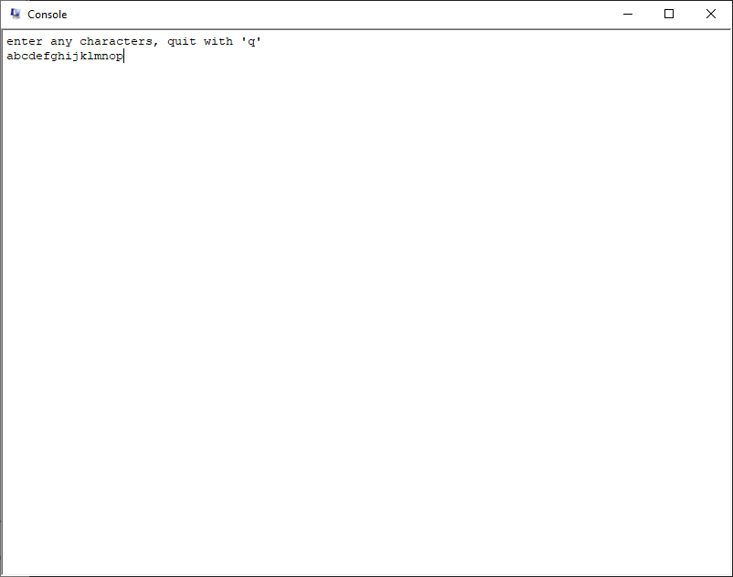
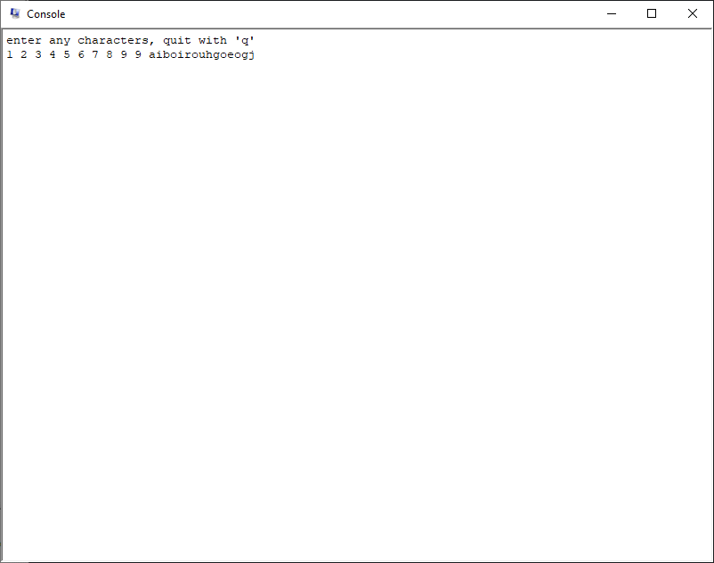
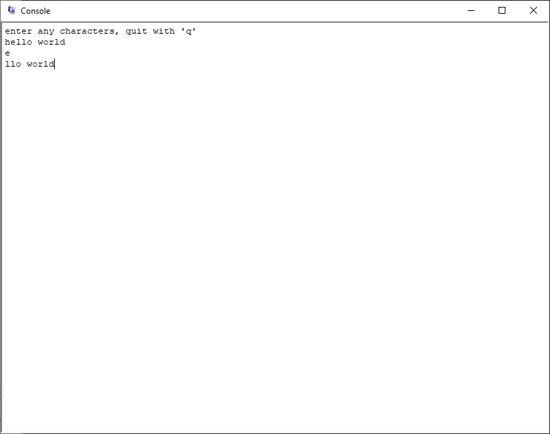

# final2.asm

## Explanation of the code:
#### Description:
Program to take digits through MM I/O and display them
#### MIPS Simulation Settings:
Bare Machine: OFF, Psuedo Instructions: ON, Mapped IO: ON,
Delayed Branches: ON, Delayed Loads: ON
#### Register use:

- `$t4` - value from status register
- `$t5` - value from cause register

## Test Case Results
#### First Test Case
 
In this test case, I inputted `abcdefghijklmnopq` into the console to see if it continue to print up until 'q'.  
As soon as I hit the 'q' key, the program exited.
#### Second Test Case
 
In this test case, I inputted `1 2 3 4 5 6 7 8 9 aiboirouhgoeogjq` to see if it could handle numbers and me spamming the console.    
It was able to handle the numbers as expected, and was also able to handle the spam. It exits as soon as I hit 'q'.
#### Third Test Case
 
In this test case, I inputted `hello world [ENTER]e[ENTER]llo worldq` to see if it could handle hitting the enter key.  
It was able to enter a line break character just fine, and then exited when hitting the 'q' key.
#### Fourth Test Case
 
And finally, in this test case I inputted `q`. I kind of expected it to just exit right away, and that's exactly what happened.  
Was this test case needed? Probably not but I wanted to see if anything unexpected happened.